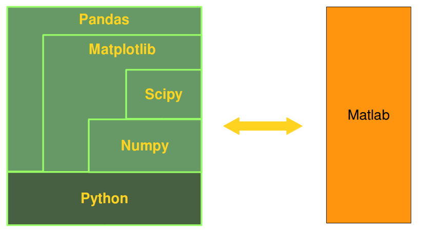

# 4.Numpy_and_beyond

Numpy is the core library for scientific computing in Python. It provides a high-performance multidimensional array object, and tools for working with these arrays. 




Cite: picture came from [python-course](http://www.python-course.eu/numpy.php)


***

Simple creation.

``` python
import numpy as np
a = [[1,2,3],[4,5,6]]
print(a)
# [[1, 2, 3], [4, 5, 6]]

b = np.array(a)
print(b)
#array([[1, 2, 3],
#       [4, 5, 6]])

print(a[0][0], b[0][0])

# NICER
print(b[0,0])
```

***
Common usage.

``` python
# Ref: [python-numpy-tutorial](http://cs231n.github.io/python-numpy-tutorial/)

import numpy as np

a = np.zeros((2,2))  # Create an array of all zeros
print a              # Prints "[[ 0.  0.]
                     #          [ 0.  0.]]"
    
b = np.ones((1,2))   # Create an array of all ones
print b              # Prints "[[ 1.  1.]]"

c = np.full((2,2), 7) # Create a constant array
print c               # Prints "[[ 7.  7.]
                      #          [ 7.  7.]]"

d = np.eye(2)        # Create a 2x2 identity matrix
print d              # Prints "[[ 1.  0.]
                     #          [ 0.  1.]]"
    
e = np.random.random((2,2)) # Create an array filled with random values
print e                     # Might print "[[ 0.91940167  0.08143941]
                            #               [ 0.68744134  0.87236687]]"

# arange <=> array(range)
f = np.arange(10)
print(f)
# array([0, 1, 2, 3, 4, 5, 6, 7, 8, 9])

# But more than that

range(1,3,0.2)
# TypeError: 'float' object cannot be interpreted as an integer
np.arange(1,3,0.2)
# array([ 1. ,  1.2,  1.4,  1.6,  1.8,  2. ,  2.2,  2.4,  2.6,  2.8])
```

***

More slice.

``` python
# http://cs231n.github.io/python-numpy-tutorial/
a = np.array([[1,2],[3,4],[5,6]])

# find all elements greater than 2
bool_idx = a > 2

print(bool_idx)

# array([[False, False],
#       [ True,  True],
#       [ True,  True]], dtype=bool)

print(a[bool_idx])
# [3 4 5 6]
print(a[a>2])
# [3 4 5 6]
```

``` python
# similar one, find all even elements

print(a[a%2==0])
# [2 4 6]
```


***

Datatypes and math operation (and difference between list and numpy.ndarry)

``` python
l = [[1,2],[3,4],[5,6]]
a = np.array(l)
print(type(a), a.dtype)
# <class 'numpy.ndarray'> int32

# add 2
a+2
# array([[3, 4],
#       [5, 6],
#       [7, 8]])

l+2
# TypeError: can only concatenate list (not "int") to list

# subtraction is same as addition

# multiply 2
a*2
# array([[ 2,  4],
#       [ 6,  8],
#       [10, 12]])

l*2
# [[1, 2], [3, 4], [5, 6], [1, 2], [3, 4], [5, 6]]
# ATTENTION!!


# divide by 2
a/2
# l/2
# -> TypeError: unsupported operand type(s) for /: 'list' and 'int'
```

***

More math operation and helper functions

`dir(np)`

``` python
a = np.array([1,2])
b = np.array([[3],[4]])
print(a.dot(b))
print(np.dot(a,b))
# [11]

x = np.array([[1,2],[3,4]])
print(np.sum(x))
# 10
print(np.sum(x, axis=0))
# [4 6]
print(np.sum(x, axis=1))
# [3 7]
print(x.T)
# [[1 3]
#  [2 4]]
```

***

`reshape`

``` python
a = np.arange(10)
a.reshape(2,5)
# array([[0, 1, 2, 3, 4],
#        [5, 6, 7, 8, 9]])

a.reshape(5,2)
# array([[0, 1],
#       [2, 3],
#       [4, 5],
#       [6, 7],
#       [8, 9]])
```

***

`view` and `copy`

>Attention: Whereas slicings on lists and tuples create new objects, a slicing operation on an array creates a view on the original array. So we get an another possibility to access the array, or better a part of the array. From this follows that if we modify a view, the original array will be modified as well. <br> -- [python-course](http://www.python-course.eu/numpy.php)


``` python
a = np.arange(10)
a = a.reshape(2,5)
b = a[:,0]
c = a[0,:]
d = a[0]
e = np.copy(a[0])

d[0] = 100
print(d)
# array([100,   1,   2,   3,   4])
print(c)
# array([100,   1,   2,   3,   4])
print(b)
# array([100,   5])
print(e)
# array([0,   1,   2,   3,   4])

# This can be a little confuse
f = a[[0,1],[0,0]]
print(f)
# [100   5]
```


## Graphical Expression

>a picture is worth a thousand words

[Nice graphical representation of numpy operations at the end](http://www.labri.fr/perso/nrougier/teaching/numpy/numpy.html)

[quick-references of from-python-to-numpy](http://www.labri.fr/perso/nrougier/from-python-to-numpy/#quick-references)

See [4.Numpy_and_beyond_images.md](4.Numpy_and_beyond_images.md) for more info.


## A little more

`matplotlib`

``` python
import numpy as np
import matplotlib.pyplot as plt

# Compute the x and y coordinates for points on a sine curve
x = np.arange(0, 3 * np.pi, 0.1)
y = np.sin(x)

# Plot the points using matplotlib
plt.plot(x, y)
plt.show()  # You must call plt.show() to make graphics appear.
```

See [1](numpy_and_beyond/plt_1.py), [2](numpy_and_beyond/plt_2.py), [3](numpy_and_beyond/plt_3.py) for more example.


## So what's next?

It should be enough for the fundamental parts of python, however, as a tool, just the grammar and some simple tricks are not enough,

>Practice makes perfect.

(Well, who cares perfect, just make it work and things much more easy)

### Calculate PI

How to calc pi or area of some closed shapes?

[calc_pi](numpy_and_beyond/calc_pi.py)


## Reference

* [python-numpy-tutorial](http://cs231n.github.io/python-numpy-tutorial/)
* [from-python-to-numpy](www.labri.fr/perso/nrougier/from-python-to-numpy)
* [teaching-numpy](http://www.labri.fr/perso/nrougier/teaching/numpy/numpy.html)