>a picture is worth a thousand words

[Nice graphical representation of numpy operations at the end](http://www.labri.fr/perso/nrougier/teaching/numpy/numpy.html)

[quick-references of from-python-to-numpy](http://www.labri.fr/perso/nrougier/from-python-to-numpy/#quick-references)

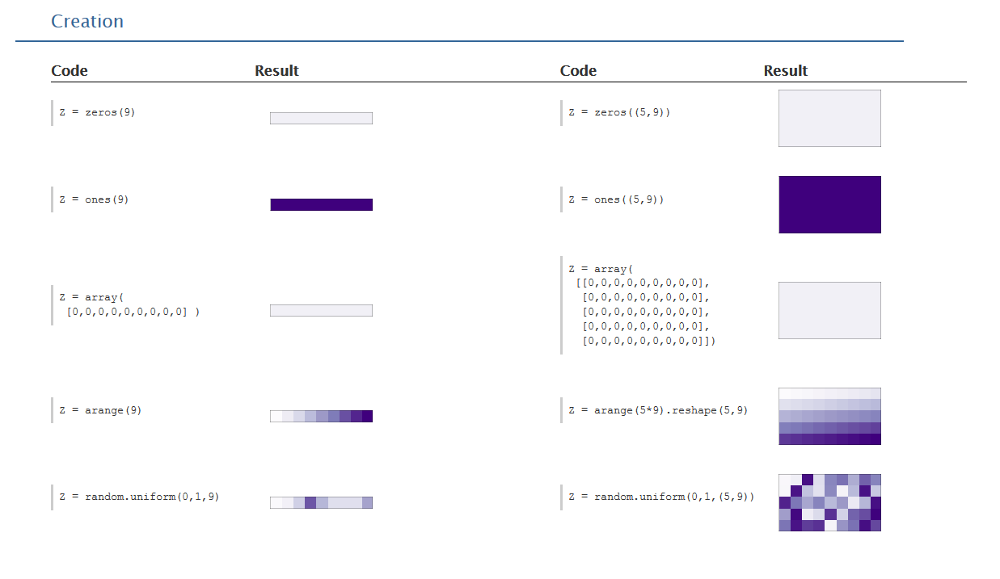{#fig:np_pic_1 width:80%}

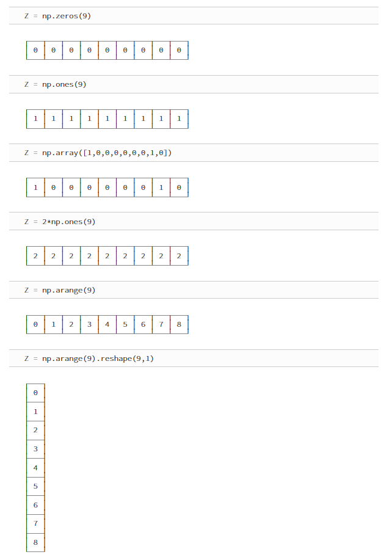{#fig:np_pic_6 width:80%}

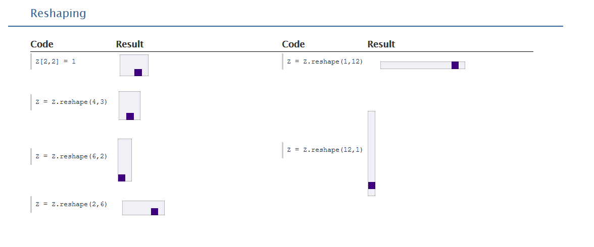{#fig:np_pic_2 width:80%}

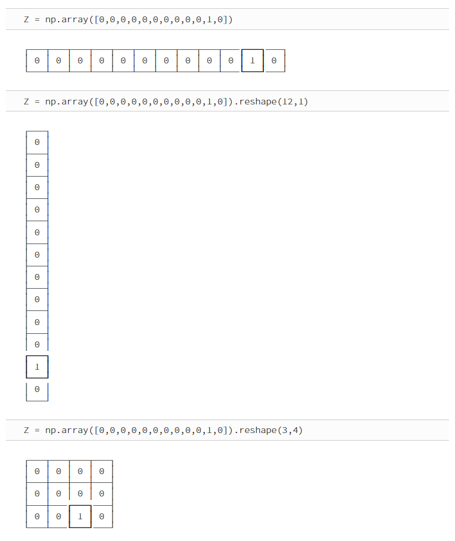{#fig:np_pic_9 width:80%}

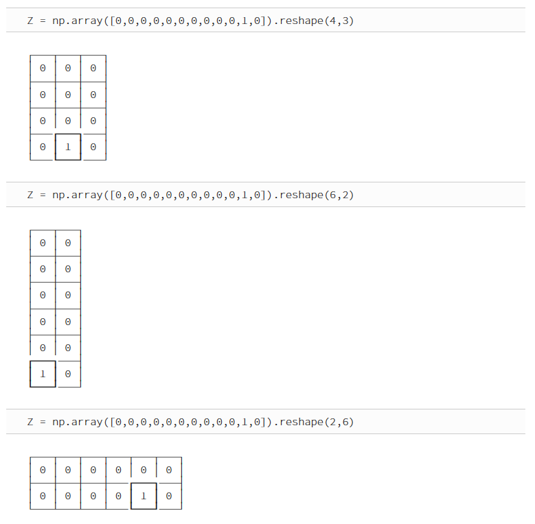{#fig:np_pic_10 width:80%}

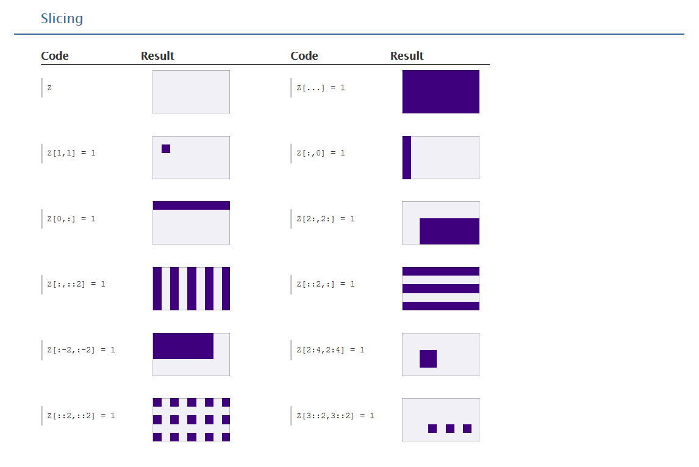{#fig:np_pic_3 width:80%}

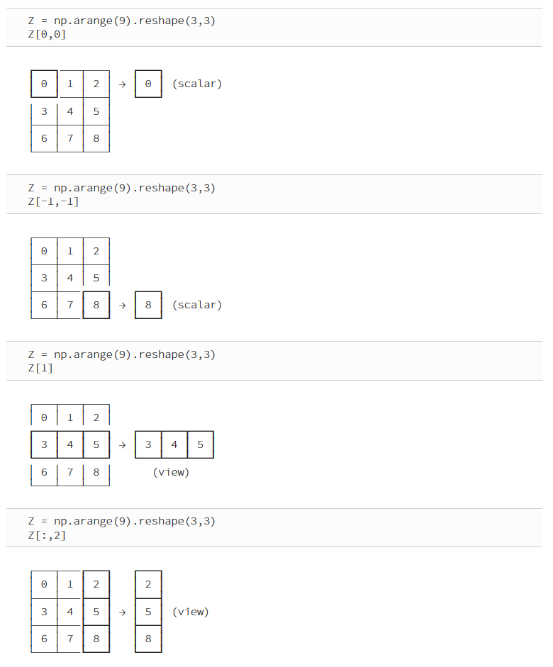{#fig:np_pic_7 width:80%}

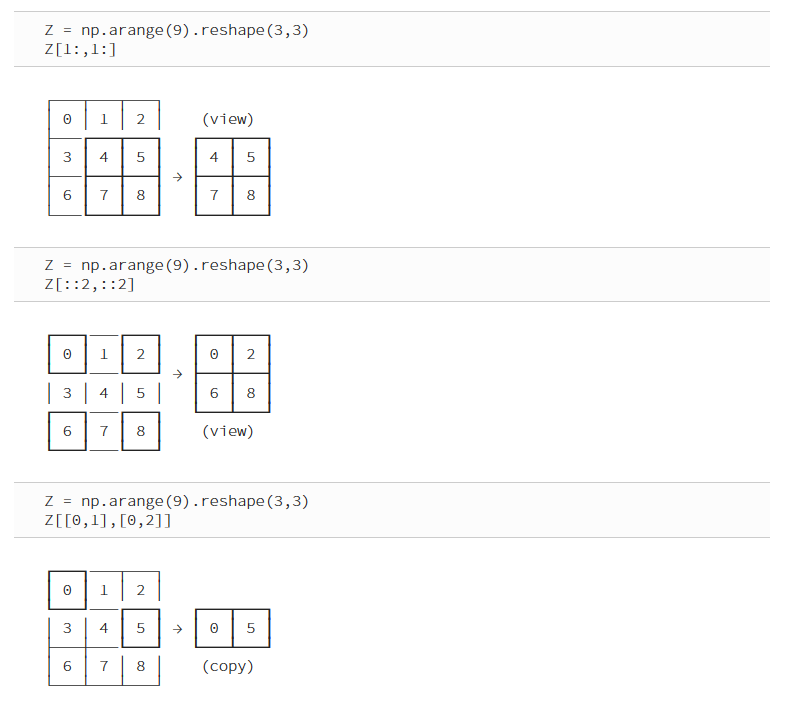{#fig:np_pic_8 width:80%}

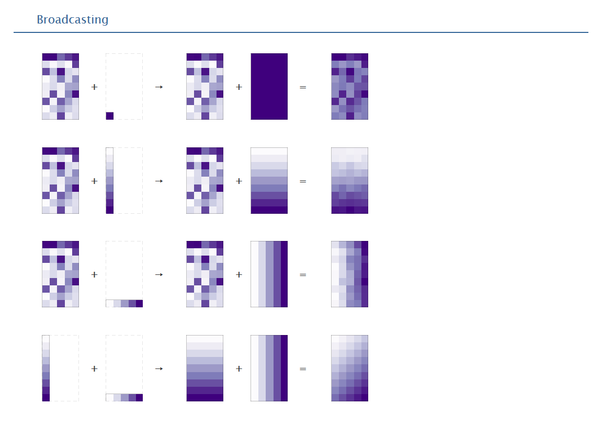{#fig:np_pic_4 width:80%}

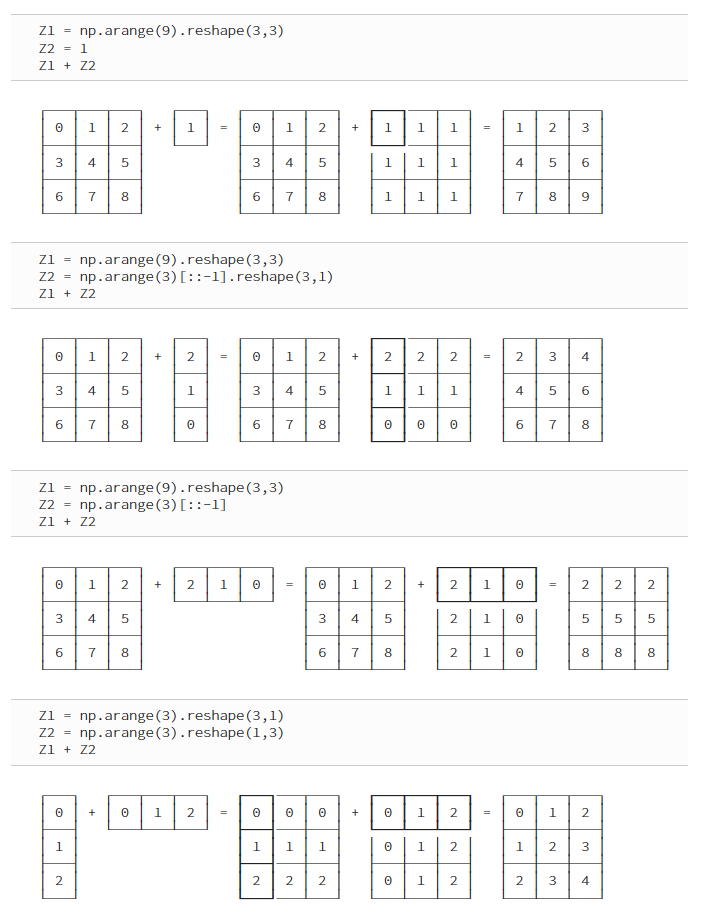{#fig:np_pic_11 width:80%}

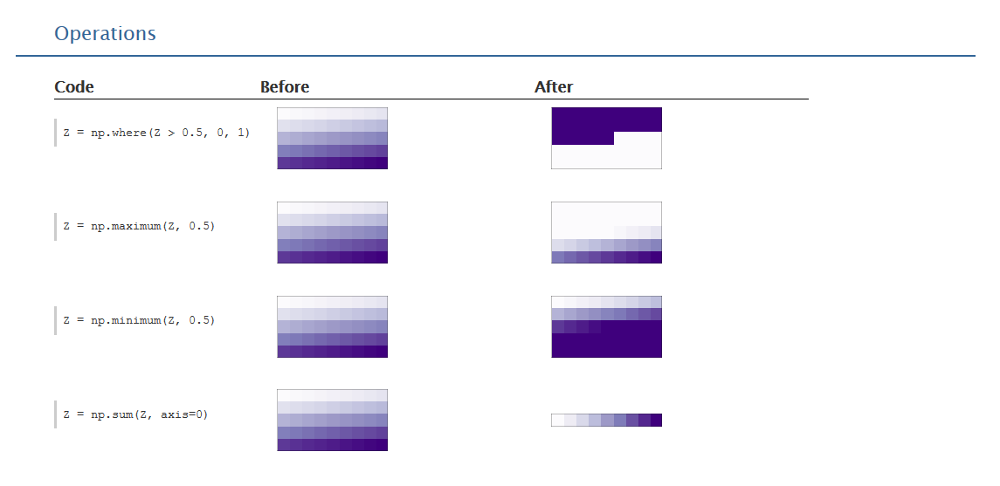{#fig:np_pic_5 width:80%}