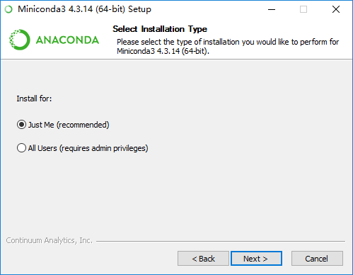
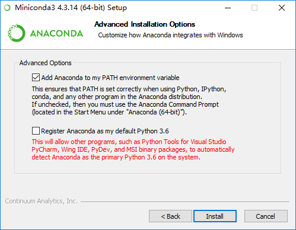

# Different ways to install the scikit-learn environments

* `pip` way
* `Miniconda` way
* `Anaconda` suite

## `pip` way

I failed to do this on windows. (Great chances are that I miss some crucial dependences for building the necessary libraries).

## `Miniconda` way

### Install `Miniconda`
    * download the right version for your system from the [official site](https://conda.io/miniconda.html)
    * in case of polluting the PATH
        - choose `Just Me(recommended)` in the `Installation Type`, which will make the installation destination folder becomes `C:\Users\<YOUR_PC_NAME>\Miniconda3` (or something like this in other platforms), we will refer to this latter.
        - uncheck the second one in the `Advanced Options`, so that the default python3 path is not changed.






### Create a fresh virtual environment

This can be thought as unnecessary at first glance, but it is necessary!

``` vi
# type this in any folder is OK
$ conda create -n test_py2 python=2
```

We will get something like:
```
Fetching package metadata ...........
Solving package specifications: .

Package plan for installation in environment C:\Users\miao\Miniconda3\envs\test_py2:

The following NEW packages will be INSTALLED:

    pip:            9.0.1-py27_1
    python:         2.7.13-1
    setuptools:     27.2.0-py27_1
    vs2008_runtime: 9.00.30729.5054-0
    wheel:          0.29.0-py27_0

Proceed ([y]/n)?
```

So,

* We can create a virtual environment with uninstalled python (the `python=2` in command) easily.
* `Solving package specifications: .` will take care all the dependences
* `pip:            9.0.1-py27_1` or `vs2008_runtime: 9.00.30729.5054-0` and so on, all libs will be installed with suitable harmonious versions.

Then just type `Enter` to that question will lead us to:

``` vi
vs2008_runtime 100% |###############################| Time: 0:00:25  40.90 kB/s
python-2.7.13- 100% |###############################| Time: 0:00:12   2.01 MB/s
setuptools-27. 100% |###############################| Time: 0:00:00   3.13 MB/s
wheel-0.29.0-p 100% |###############################| Time: 0:00:00   4.44 MB/s
pip-9.0.1-py27 100% |###############################| Time: 0:00:00   3.50 MB/s
#
# To activate this environment, use:
# > activate test_py2
#
# To deactivate this environment, use:
# > deactivate test_py2
#
# * for power-users using bash, you must source
#
```

This will install a fresh environment of python2 into folder `C:\Users\miao\Miniconda3\envs>`. NOTE:**Change `miao` to `YOUR_PC_NAME`**

At last, just type `activate test_py2` will make the virtual environment activated, and we can test it:

``` vi
H:\>activate test_py2

(test_py2) H:\>which python
C:\Users\miao\Miniconda3\envs\test_py2\python.EXE

(test_py2) H:\>which pip
C:\Users\miao\Miniconda3\envs\test_py2\Scripts\pip.EXE

(test_py2) H:\>which conda
C:\Users\miao\Miniconda3\envs\test_py2\Scripts\conda

(test_py2) H:\>
```


In case we forget environments' names we have created, type `conda info --envs` will show us the results:

```
# conda environments:
#
test_py2                 C:\Users\miao\Miniconda3\envs\test_py2
root                  *  C:\Users\miao\Miniconda3
```

And of course, you can choose different install configurations, like changing the destination folder of the installation (`-p` flag, with should use without `-n`), type `conda install --help` for more info.

### Install the necessary libraries.

We will create another virtual environment named `sklearn_py3` as before:

``` vi
conda create -n sklearn_py3 python=3
```

Let us first install the [minimal libraries](http://scikit-learn.org/stable/install.html) to try the `scikit-learn` library in our virtual environments:

``` vi
$ activate skleran_py3
(sklearn_py3)$ conda install numpy scipy scikit-learn
```

And we will install other libraries when necessary.

To test it, try this simple example:

``` vi
>>> from sklearn import datasets
>>> iris = datasets.load_iris()
>>> dir(iris)
['DESCR', 'data', 'feature_names', 'target', 'target_names']
>>> iris.feature_names
['sepal length (cm)', 'sepal width (cm)', 'petal length (cm)', 'petal width (cm)']
>>> len(iris.data)
150
>>> len(iris.target)
150
```

And you are ready for the Machine Learning world!


## `Anaconda` Suite

Download the proper version from [the official site](https://www.continuum.io/downloads).

And create virtual environment as before, but you will find that no `extra` libraries appeared.

In fact, what we should do is:

``` vi
$ conda create -n sklearn_py3_all --clone root
```

Which means we want to clone the environments of `root`, in this way, we don't need `conda install` all the installed libraries within the `Anaconda` suite.

You will get something like below:

``` vi
Source:      C:\Users\miao\Anaconda3
Destination: C:\Users\miao\Anaconda3\envs\sklearn_py3_all
The following packages cannot be cloned out of the root environment:
 - conda-build-2.0.2-py35_0
 - conda-4.3.17-py35_0
 - conda-env-2.6.0-0
Packages: 179
Files: 83
#
# To activate this environment, use:
# > activate sklearn_py3_all
#
# To deactivate this environment, use:
# > deactivate skleran_py3_all
#
# * for power-users using bash, you must source
#
```

Test it use the former example -- the iris dataset example.

## update before use

It's suggested to update all necessary libraries at first, after `activate` our environment, type:

``` vi
$ conda update --all
```

## Mirrors for `conda`

When encountering slow internet connection, checkout [https://mirrors.tuna.tsinghua.edu.cn/help/anaconda/](https://mirrors.tuna.tsinghua.edu.cn/help/anaconda/).