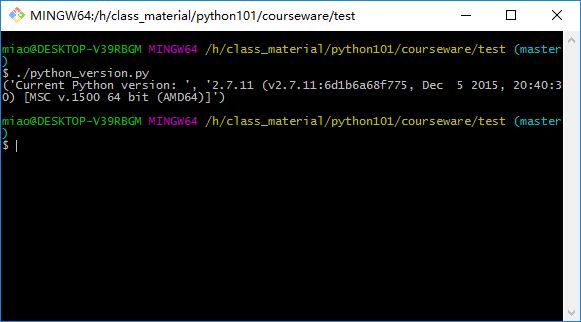

# Recap and homework

>Practice makes perfect
>
-- by almost everyone.

To recap what we have learned, the nice (and maybe hard) way is just look at [our syllabus](../syllabus.md) and try to enrich it to something like our HTML-form ppts, e.g. [1.Fundamentals](1.Fundamentals.md) or [2.Automate_boring_stuff](2.Automate_boring_stuff.md). To make things easier, 
browse through the *ppts* is good enough.

However, maybe some little QUIZ can be appealing (at least according to you all last friday). So here it is!

Quizzes are based on syllabus, and `TIPS` are just for `reference`, correct or enhance them please!

NOTE: the question labeled with 🐱 can be skipped at the first time, since they may require something or tools we do not need at present. When you finished others, come back and consider these questions.

# 0.Environment & Setup

Questions:

* 1.How make sure install python successfully?
* 2.Try to run python code in a (.py) file.
* 3.Install [vscode](http://code.visualstudio.com/)
* 4.and try to run/debug python code in vscode.


TIPS:

* 1.Type `python` in the console.
* 2.Can be a simple file like:

``` python
# name this file as 'test_py.py'
print('This is a nice day')
```

And open console (CMD in windows), navigate to the dictionary contains the file.Or, open console in that dictionary, in windows just `Shift + Right click` and choose the proper one.

Then, type `python test_py.py`, should have no problem.


* 4.May install `python` extension of vscode first.

# 1.Fundamentals of python

* 1.Add `#! /usr/bin/python2` and `if __name__ == '__main__':` to form a better formated python file.
* 2.Install [git](https://git-scm.com/) 🐱
* 3.Validate `#! ` dose change the interpreter to be used 🐱

TIPS:

* 2.Git are useful if we want to make file versions and revert to a specific version of file long time ago. So we can just say goodbye to the `xxx_version_001`,`xxx_version_002`,`xxx_version_001_rewrite`,`xxx_version_101_WTF`.
* 3.To validate interpreter can be changed, we should have more than one version of python installed.

Download and install 2.7.x from the [official site of python](https://www.python.org/).(For mac, python 2.x.x has been installed, can skip this step).

File below can be changed to validate (save as `python_version.py`):

``` python
#!/usr/bin/python2
# -*- coding:utf-8 -*-


"""
Demo of #! python_path to use certain python
**That sentence should be exactly at the first line**
"""

import sys

print("Current Python version: ", sys.version)
```

AND change the content after `#!`:

In mac, things should be very strict, just change the path to a different python interpreter. Then type 

``` vi
$ chmod +x python_version.py # means to make python_version.py executable
$ ./python_versino.py # run the file and should output different answers with different python version.
```


In windows, things maybe a little complex (just maybe), if `git` has be installed as above, just `right click` and open `Git bash here`. Then a black console window should be appeared, and type:

``` vi
$ ./python_versino.py
```




Output should be similar. Note: python should be installed in `C:\Python27` and `C:\Python36` as default (or file name like these), so change the first line in `python_version.py` to `#! C:\Python27\python` or `#! C:\Python36\python` to see the difference.

## Primitive DataTypes and Operators

### int & float

* 1.How to assign an int/float to a variable?
* 2.Do elementary arithmetic (+,-,*,/) with two number.
* 3.Change number type, `int->float` and `float->int`
* 4.`round`,`floor`,`ceil`


TIPS:

* 1.
``` python
i1 = 42
i2 = int(42)
f1 = 42.0
f2 = float(42) # float(42.0)
```

Use `typeof` to find the type of a variable.

* 2.Note: `/` and `//` are not the same, try `%`
* 3.`int(f1)`, `float(i1)`

### boolean & none & string

* 1.`and`, `or`, `not`
* 2.**slice operation** with string
    - reverse index
    - reverse str
    - get string except the first char
    - get first half of the str
    - omit the odd chars
* 3.determine whether a char is in string
* 4.Format output
    - `{} {}`
    - `{1} {0}`
    - `{A} {B}`

TIPS:

* 1.**DO NOT** use `&&`,`||`,`!` to replace `and`, `or`, `not`!!
* 2.Slice operation can be **VERY** useful when we do stuff with `numpy` -- the base library for scientific programming in python ecosystem.

## Collections

### list & tuple

* 1.Create list `[1,2,3,4,5,...,42]`, 1 to 42.
* 2.Add/delete element in a list
    - remove the first one?
    - remove the third one?
* 3.reverse list
* 4.slice operation

    And **repeat** with the experiments as list above in sting

* 5.How to add two lists to one?

* 6.**Try above** with `tuple`


TIPS:

* 1.`range(100)` and `list(range(100))`
* 2.`append`, `pop`, `pop(0)`, `pop(1)`, `pop(-1)`
* 3.difference between `li[::-1]` and `li.reverse()`?
* 5.difference between `li_1 + li_2` and `li_1.extend(li_2)`?

* 6.Tuple can not be modified, so 2,5 do not apply. However, `t1 + t2` dose return a new tuple.


## Control Flow and Iterable

* 1.`if-then-else`

Try to assign centesimal system grades to A,B,C,D,E,F

```
>=90 <-> A
>=80 <-> B
>=70 <-> C
>=60 <-> D
< 60 <-> F
```


``` python
score = 42 # change the score as you like

if score > 90:
    print('You got A!')
[...]

```


* 2.`while`
    
    Sum odd numbers less than 42

* 3.`for`
    
    Do the same as `while`

* 4.`continue`

    Do the same as `while` but except `33`

* 5.`break`